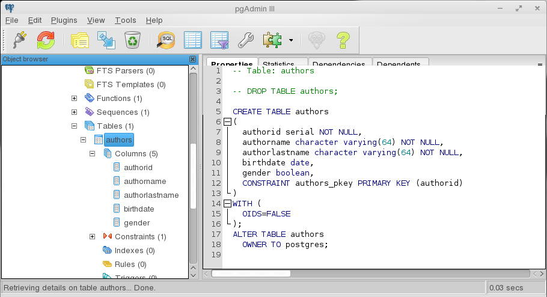
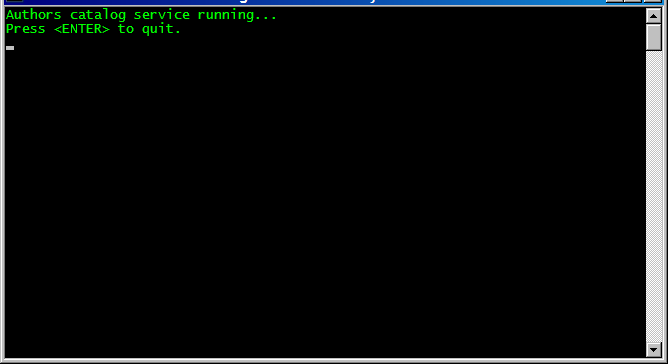
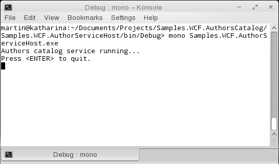
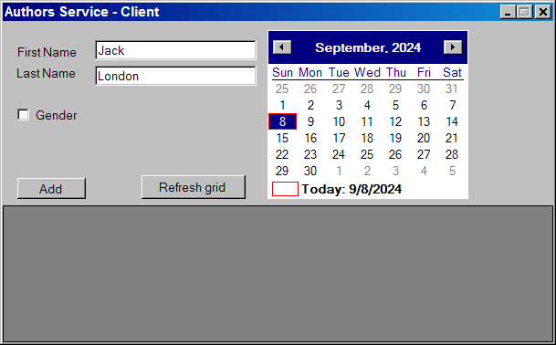
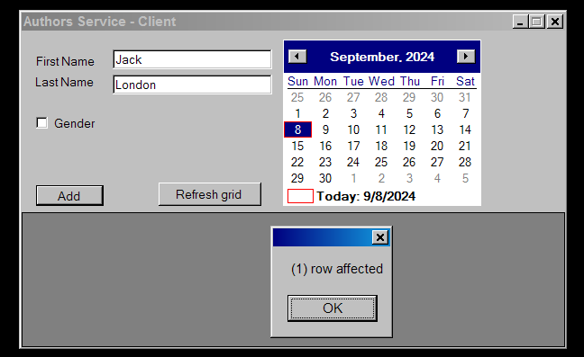
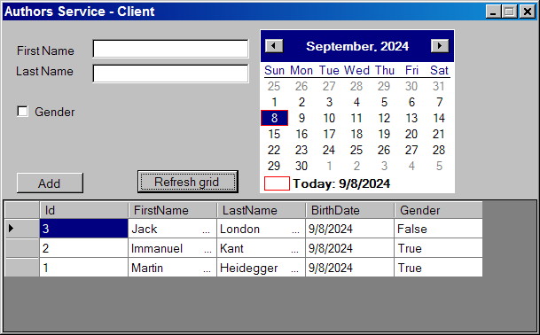
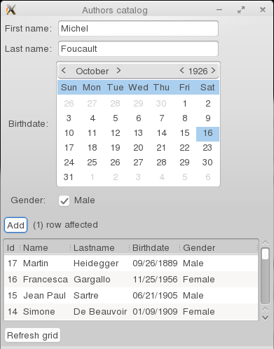
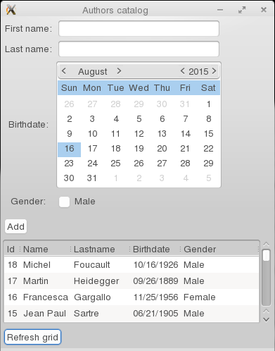
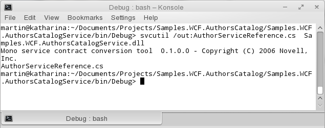

# Entendiendo DataContract y DataMember de WCF con C#
		

Un contrato se define como: “un acuerdo entre partes que se debe de cumplir de manera obligada por cada una de ellas”, los contratos deben ser claros, definidos y sin ambigüedad para no dar lugar a una mala interpretación.

<a href="https://msdn.microsoft.com/en-us/library/dd456779(v=vs.110).aspx">Windows Communication Foundation</a> WCF utiliza este mismo concepto para definir un acuerdo entre clientes y servicios de un ambiente SOAP, en este contexto el contrato WCF define:
        <ul>
            <li>Las operaciones soportadas por el servicio.</li>
            <li>Los parámetros y los tipos de datos que regresan las operaciones.</li>
            <li>La estructura de los tipos de datos complejos que se pasan.</li>
            <li>Errores que pueden ocurrir al ejecutar una operación.</li>
        </ul>

Hay que recordar que los ambientes SOA son heterogéneos, por eso es recomendable que el contrato este separado de la implementación y que esa implementaciòn evite tipos específicos de su tecnología ya que esto podría causar problemas de portabilidad para comunicarse con un cliente que este implementado con una tecnología diferente.

Los contratos en el contexto SOA proporcionan todo el metadata necesario para comunicarse con el servicio, el metadata describe: tipos de datos, operaciones, patrones de intercambio de mensajes y el protocolo de transporte que se utiliza.

WCF define tres principales tipos de contrato:

    

            <ul>
                <li><b>Service contract:</b> Define las operaciones que el servicio tendrá disponibles para que los clientes puedan invocar mediante una petición request.</li>
                <li><b>Data contract:</b> Define la estructura de los datos que serán incluidos en el intercambio de los mensajes que van y vienen del servicio al cliente y viceversa.</li>
                <li><b>Message contract:</b> Habilita el control de los headers (encabezados) que utilizan los mensajes y como son utilizados por el servicio.</li>
            </ul>
        

        
WCF utiliza el protocolo SOAP (Simple Object Access Protocol) como el formato de mensajería para las operaciones, cada operación desde el service contract (contrato de servicio) se vuelve un elemento en el cuerpo del mensaje cuando la operación es invocada.

        
En la definición de la operación se especifican los datos que son intercambiados entre el cliente y el servicio cuando la operación es invocada, como ejemplo la siguiente operación createAuthor para agregar un autor a una base de datos:

        <pre>
            [OperationContract]
        string CreateAuthor (string Firstname,
            string Lastname,
            DateTime Birthdate,
            bool Gender); 
        </pre>
        

            <ul>
                <li>Los parámetros de entrada en la operación definen los contenidos del cuerpo del mensaje enviado desde el cliente al servicio.</li>
                <li>El valor de retorno en la operación define los contenidos del cuerpo del mensaje enviado desde el servicio al cliente.</li>
            </ul>
        

        
De manera predetermina el runtime de WCF toma la responsabilidad de convertir los tipos simples de .NET a tipos SOAP y viceversa, definiendo los tipos simples como:
        <ul>
            <li>Primitivos como enteros y cadenas.</li>
            <li>Tipos compuestos simples (struct) como DateTime</li>
            <li>Tipos basados en XML como un XmlElement</li>
            <li>Colecciones</li>
            <li>Enumeraciones</li>
        </ul>
        

        
Sin embargo para tipos mas complejos como las clases o los tipos de datos definidos por el usuario es recomendable que se programe manualmente el mecanismo  de serialización/ desealización y esto se logra definiendo un <b>DataContract</b> para ese tipo de dato.

        
En síntesis, para que un tipo de dato complejo sea serializado por el serializador de WCF se le debe aplicar un atributo <b>DataContract</b> a la definición de la clase y aplicar un atributo <b>DataMember</b> a cada uno de los campos que necesiten ser serializados sean estos un miembro de datos o una propiedad, los campos a los que no se les aplique el atributo <b>DataMember</b> son ignorados por el serializador.

        
Como ejemplo de los atributos <b>DataContract</b> y <b>DataMember</b> definimos una clase <i>Author</i> que encapsula los parámetros de entrada de una nueva versión de la operación <i>createAuthor</i>.

Ahora la  versión de la operación <i>createAuthor</i> 

        <pre>            
        [OperationContract]
        string CreateAuthor (Author a); 
        </pre>
        
Adicionalmente podemos agregarle las siguientes propiedades al atributo <b>DataContract</b>:
        <ul>
            <li><b>Name:</b> Define el nombre del tipo que se genera en el metadata. Por default se utiliza el nombre del tipo.</li>
            <li><b>NameSpace:</b> Define el namespace utilizado en el esquema. Por default utiliza “http://tempuri.org”</li>
        </ul>
        

        
De igual modo podemos agregar las siguientes propiedades al atributo <b>DataMember</b>:
        <ul>
            <li><b>Name:</b> Define el nombre que se utilizará en la generación del metadata. Por default es el nombre del campo.</li>
            <li><b>IsRequired:</b> Campo requerido, arroja una excepción si este campo no está cuando ocurra la deserialización.</li>
            <li><b>EmitDefaultValue:</b> Le dice al serializador que incluya el valor por default del campo cuando ocurra la serialización.</li>
            <li><b>Order:</b> Indica la posición del campo en la secuencia de serialización.</li>
        </ul>
        

<h2>Ejemplo de una aplicación GTK# y un servicio WCF</h2>

Ahora un ejemplo funcional de una aplicación GTK# que hace uso de un servicio WCF para insertar y obtener registros de una tabla de autores en una base de datos PostgreSQL.

 

Bien ahora una vista de la solución en el explorador de soluciones de <b>Monodevelop</b>.

 

La solución se llama <i>Samples.WCF.AuthorsCatalog</i> y tiene los siguientes proyectos:
<ul>
<li><b>Samples.WCF.AuthorsCatalog:</b> Este proyecto contiene la entidad Author que es la clase que es serializada por el runtime para intercambiar los datos entre la aplicación GTK# y el servicio WCF.</li>
<li><b>Samples.WCF.AuthorsCatalogService:</b> Este es el proyecto del servicio WCF, contiene la clase AuthorsDataHelper que es la que se comunica con la base de datos, la clase AuhorServiceImplementation que es la implementación del servicio y la interface IAuthorServiceContract que es el contrato del servicio.</li>
<li><b>Samples.WCF.AuthorServiceHost:</b> Este proyecto contiene una aplicación de consola que es el hosting para el servicio WCF.</li>
<li><b>Samples.WCF.GUIAuthorsCatalog:</b> Este proyecto contiene al cliente GTK# que tiene una GUI (Graphical User Interface) que utiliza la clase proxy para comunicarse con el servicio WCF.</li>
</ul>

El proyecto <i>Samples.WCF.AuthorsCatalog</i> ejemplifica la aplicación de los atributos <b>DataContract</b> y <b>DataMember</b>.

Esta clase sirve como argumento de petición y de respuesta en el contrato y por consecuente en la implementación del servicio como muestro en el código fuente del contrato y de la implementación que se encuentran en el proyecto <i>[Samples.WCF.AuthorsCatalogService]</i>.

Para ejecutar la solución primeramente ejecutamos el programa de consola <i>[Samples.WCF.AuthorServiceHost.exe]</i> que activa el proceso que alberga el servicio WCF, el ejecutable se encuentra dentro del directorio “bin” debajo de la ruta <i>Samples.WCF.AuthorsCatalog/Samples.WCF.AuthorServiceHost/bin/Debug.</i> con el siguiente comando:

        <pre>
            $ mono Samples.WCF.AuthorServiceHost.exe
        </pre>
        

        
        
 
        

        
        
 
        
Ahora ejecutamos la solución desde <b>MonoDevelop</b>.

        

        
        
 
        
Podemos probar la aplicación al agregar un par de autores, como se muestran en la siguientes imágenes, después de ingresar cada autor pulsamos el botón <i>refresh grid</i>

        

        
        
 
        

        
        
 
        

        
        
 
        
Cada uno de estos eventos se manejan a tráves de la clase proxy que se genera con el siguiente comando aplicándolo a la dll del servicio.

        <pre>
            $svcutil /out:AuthorServiceReference.cs  Samples.WCF.AuthorsCatalogService.dll
        </pre>
        

        
        
 
        
<h2>Conclusión</h2>

        
WCF proporciona facilidades para tomar el control de la serialización de datos. Sin embargo, hay que entender que entre más control manual tomes de tus servicios estos tenderán a ser menos interoperables.

